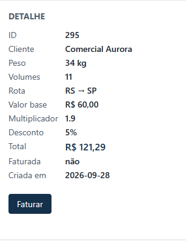
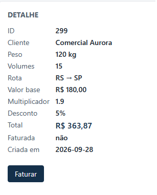

# [003] valor_total com desconto não segue o arredondamento comercial

**Severidade:** Média

**Versão afetada:** v2

**Ambiente:** v2 em http://localhost:3002.

Cotações criadas via POST /api/cotacoes com pesos fora das bordas do BUG-001 (34, 50.5 e 120 kg) e volumes fora das bordas do BUG-002 (11, 12, 15, 25 e 60), rotas SP→MG (multiplicador 1.4) e RS→SP (multiplicador 1.9). Em todos os casos, valor_base, multiplicador e desconto retornados estavam corretos, então a divergência está isolada no valor final. O desconto só existe na v2, por isso não há comparação com a v1.

## Passos para reproduzir

1. Criar uma cotação na v2 com o payload abaixo (exemplo do primeiro caso):

   POST http://localhost:3002/api/cotacoes
   Content-Type: application/json

   { "cliente": "Arredondamento 34kg RS→SP 11vol", "peso_kg": 34, "volumes": 11, "uf_origem": "RS", "uf_destino": "SP" }

2. Ler o campo valor_total da resposta.
3. Repetir com os demais casos da tabela abaixo.
4. Comparar o valor_total com o valor esperado: (valor_base × multiplicador × 1,12) × (1 − desconto), arredondado para duas casas.

## Resultado esperado 

O que diz o README: "O valor final é apresentado em reais com duas casas decimais, arredondado pela regra comercial (a partir de cinco milésimos, arredonda para cima)". 
O que diz o SPEC-desconto-por-volume.md: o desconto incide sobre o valor já com imposto e o valor final continua com duas casas decimais.

Todos os casos abaixo têm terceira casa decimal 6 ou 8, então sobem para o centavo seguinte. 

| Caso | Conta exata | valor_total esperado |
|---|---|---|
| 34kg RS→SP, 11 vol (5%) | 121,296 | 121,30 |
| 34kg SP→MG, 11 vol (5%) | 89,376 | 89,38 |
| 50.5kg SP→MG, 12 vol (5%) | 163,856 | 163,86 |
| 120kg SP→MG, 15 vol (5%) | 268,128 | 268,13 |
| 120kg RS→SP, 15 vol (5%) | 363,888 | 363,89 |
| 120kg SP→MG, 25 vol (10%) | 254,016 | 254,02 |
| 50.5kg RS→SP, 60 vol (15%) | 198,968 | 198,97 |

## Resultado obtido

| Caso | Esperado | Obtido | Diferença | Se truncasse |
|---|---|---|---|---|
| 34kg RS→SP, 11 vol | 121,30 | **121,29** | −0,01 | 121,29 |
| 34kg SP→MG, 11 vol | 89,38 | **89,37** | −0,01 | 89,37 |
| 50.5kg SP→MG, 12 vol | 163,86 | **163,84** | −0,02 | 163,85 |
| 120kg SP→MG, 15 vol | 268,13 | **268,11** | −0,02 | 268,12 |
| 120kg RS→SP, 15 vol | 363,89 | **363,87** | −0,02 | 363,88 |
| 120kg SP→MG, 25 vol | 254,02 | **254,01** | −0,01 | 254,01 |
| 50.5kg RS→SP, 60 vol | 198,97 | **198,96** | −0,01 | 198,96 |

Os dois casos em que o valor devia cair para baixo (terceira casa 2 e 4) retornaram corretamente: 34kg SP→MG 25 vol → 84,67 e 120kg RS→SP 60 vol → 325,58. 

## Causa provável

O valor final da v2 nunca sobe para o centavo seguinte nos casos testados, o que é consistente com truncamento em vez de arredondamento comercial. Em quatro casos o resultado bate exatamente com o valor truncado. Em três casos (163,84, 268,11 e 363,87) o resultado ficou um centavo abaixo até do valor cortado (truncado), o que pode ter ocorrido por arredondamento em outra parte do cálculo. Deixo como sugestão verificar o cálculo de arredondamento na cotação. 

## Impacto

O cliente é cobrado de 1 a 2 centavos a menos nos casos testados (o oposto dos BUG-001 e BUG-002, em que o cliente paga a mais). O erro só ocorre em cotações com desconto (10 volumes ou mais), quando a conta exata tem terceira casa decimal que deveria subir.

Exemplo de teste manual que me levou a verificar o cálculo: cotação de id 10 (RS→SP, 34kg, 11 volumes): valor esperado 121,30, valor na v2 121,29.

--> Observação: erro de arredondamento chega ao faturamento: 
Cotação criada: 34 kg RS→SP 11 vol faturada na v2: fatura emitida com valor 121,29 (esperado 121,30) 

## Evidência

Suíte automatizada via Postman, pasta "arredondamento_desconto". 

-->  Cotação 34 kg, RS→SP, 11 volumes exibe "Total: R$ 121,29", idêntico ao valor devolvido pela API. O valor correto pela regra do README seria R$ 121,30. 

--> Cotação 120kg, RS->SP, 15 volumes exibe valor total: R$ 363,87 e não o que seria correto pela regra: R$ 363,89. 

## Como rodar o teste via Newman 

 **npx newman run postman/collection.json -e postman/environment.json --folder arredondamento_desconto**
